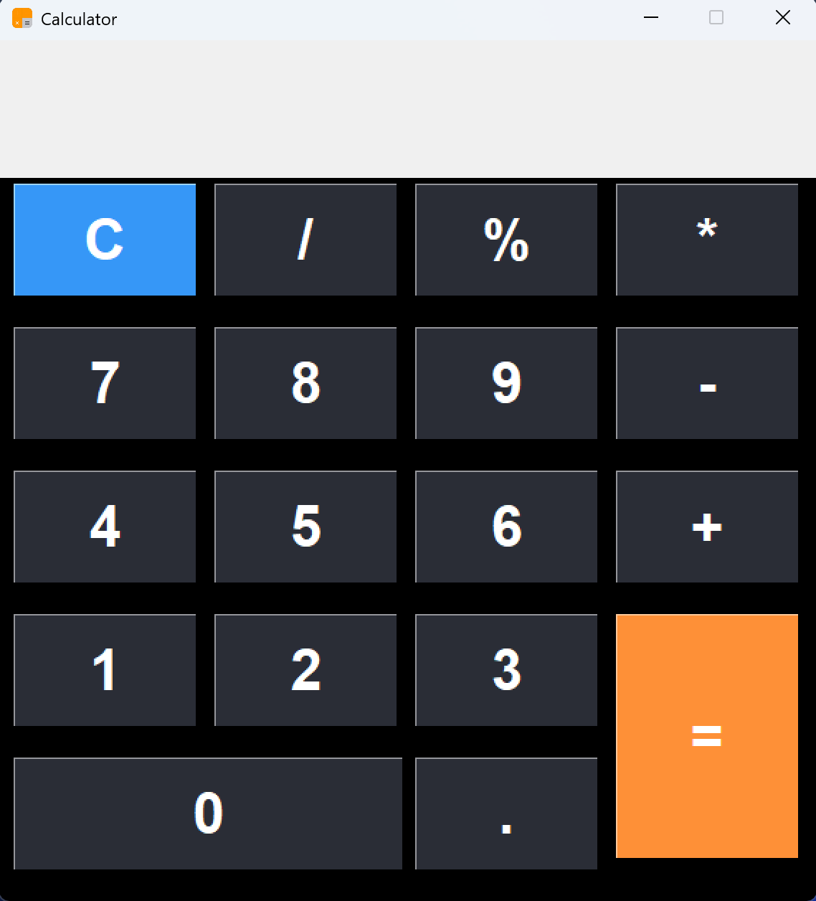

## Description
This is a simple GUI calculator implemented using Python uusing Tkinter library. It provides basic arithmetic operations and a user-friendly interface.
## Features
- *Basic Arithmetic Operations: Addition, subtraction, multiplication, and division.*  
- *Clear Button: Clears the input field.*  
- *Error Handling: Handles division by zero and other input errors gracefully.*    

