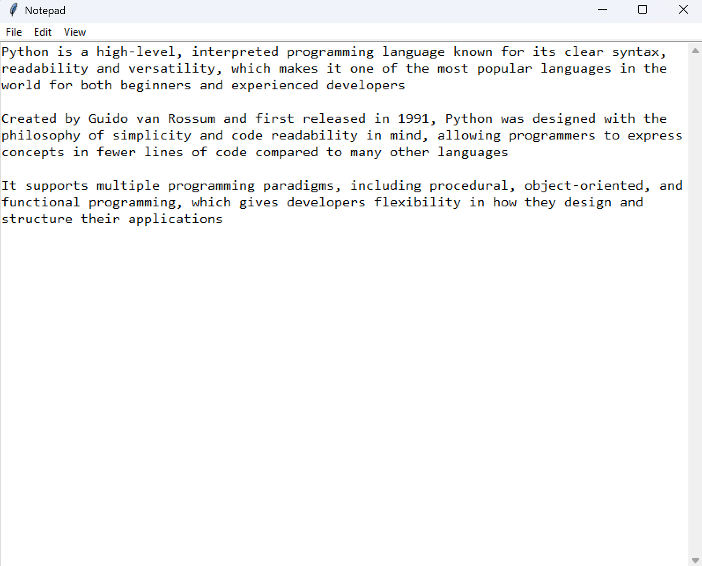

# Notepad (Python Tkinter)

A lightweight, open-source text editor built with Python and Tkinter. This application replicates core Notepad functionalities with the addition of a dark mode theme.



## Features

* **File Operations:** Create New, Open, Save, and Save As.
* **Search & Replace:** Find text strings and replace all occurrences instantly.
* **Dark Mode:** Toggle between Light and Dark themes for comfortable viewing.
* **Scrollable Interface:** Handles long text files with ease.

## Requirements

* Python 3.x
* Tkinter (Included with standard Python installations)

## Installation

1.  Clone this repository or download the files.
2.  Ensure Python is installed on your system.

## Usage

Run the script from your terminal

```bash
python notepad.py
