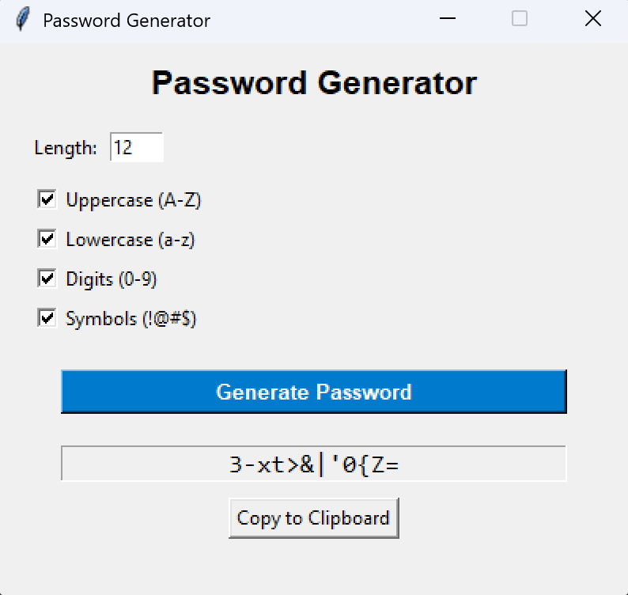

# Password Generator

A simple and efficient password generator built with Python and Tkinter. This tool allows users to create strong, random passwords with customizable options for length and character types.



## Features

* **Customizable Length:** Set the desired number of characters for your password.
* **Character Options:** Toggle uppercase letters, lowercase letters, numbers, and symbols.
* **Instant Generation:** Click to generate a new password instantly.
* **Copy to Clipboard:** One-click button to copy the result for easy use.
* **Safe Validation:** Prevents generating passwords with zero length or no character types selected.

## Requirements

* Python 3.x
* Tkinter (Included with standard Python installations)

## Installation

1.  Clone this repository or download the source code.
2.  Ensure you have Python installed.

## Usage

Run the application using the following command:

```bash
python password_generator.py
